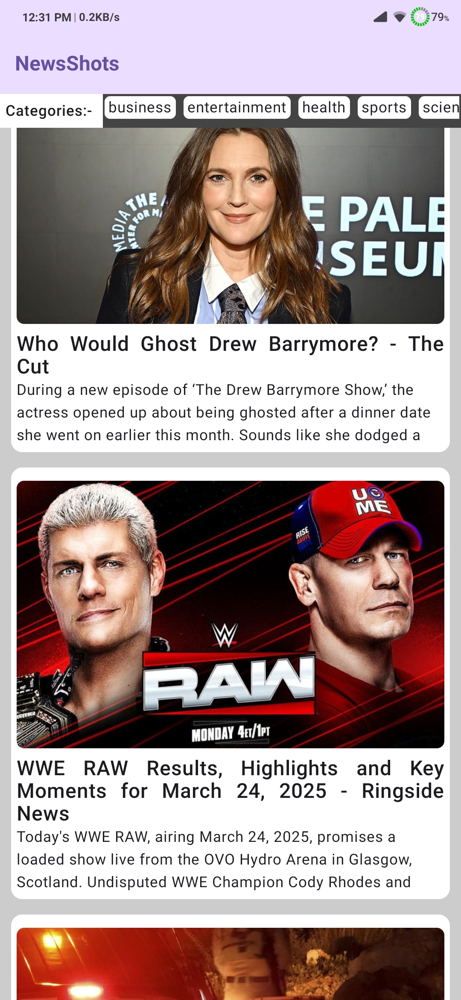
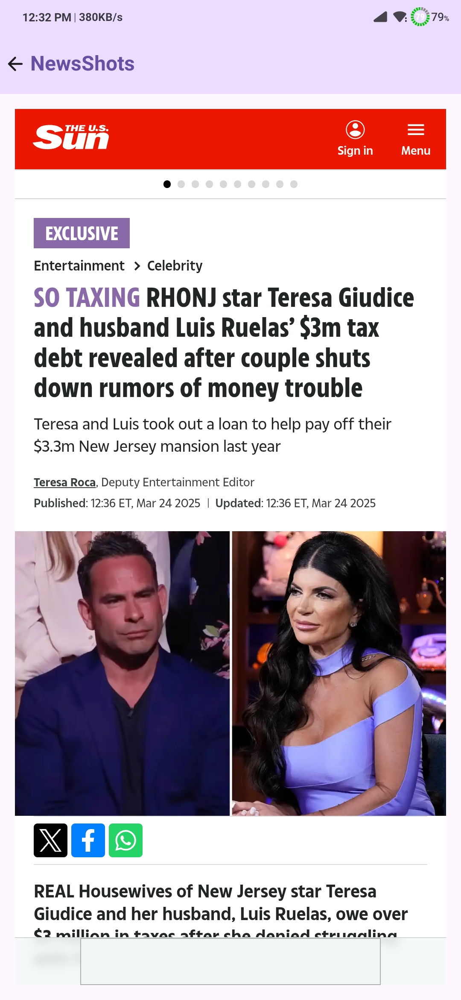
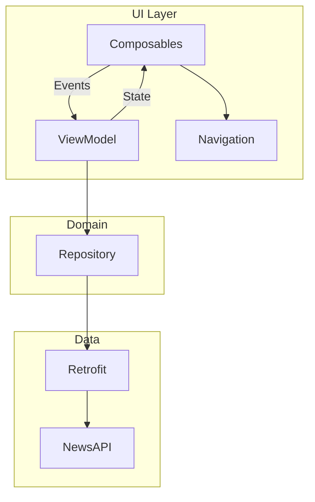

# NewsShots 📰

A modern Android news app built with Jetpack Compose and NewsAPI.org integration

[](https://kotlinlang.org)
[](https://developer.android.com/jetpack/compose)
[](https://newsapi.org)

<p align="center">
  
  
</p>

**DEMO**


## Features ✨

- 🗞️ Clean news feed with multiple categories
- 📰 Full article view with WebView integration
- 📱 Responsive UI for all screen sizes
- 🚀 Built with modern Android architecture

## Tech Stack 🛠️

- **Language**: [Kotlin](https://kotlinlang.org/)
- **UI**: [Jetpack Compose](https://developer.android.com/jetpack/compose)
- **Network**: [Retrofit](https://square.github.io/retrofit/) + [OkHttp](https://square.github.io/okhttp/)
- **Architecture**: MVVM with Repository pattern
- **Async**: [Coroutines](https://developer.android.com/kotlin/coroutines)
- **Navigation**: [Compose Navigation](https://developer.android.com/jetpack/compose/navigation)

## Setup Instructions ⚙️

1. **Clone the repository**
   ```bash
   git clone https://github.com/mrkaran007/NewsShots.git
   ```
2. **Get API KEY**
   - Register at [NewsAPI.org](https://newsapi.org/)
   - Get your free API key

3. **Add API Key**
   - Directory: app/src/main/java/com/mrk/newsapp/utils/const.kt
   ```bash
   const val API_KEY : String = "ADD_YOUR_API_KEY"
   ```
4. **Build and Run**
   ```bash
   ./gradlew assembleDebug
   ```

## Architecture 🏛️

NewsShots follows **MVVM (Model-View-ViewModel)** architecture with Clean Architecture principles:



## Contributing 🤝
   Contributions are welcome! Please follow these steps:
   1. Fork the project
   2. Create your feature branch
       ```bash
       git checkout -b feature/AmazingFeature
       ```
   3. Commit your changes
      ```bash
       git commit -m 'Add some AmazingFeature'
       ```
   4. Push to the branch
      ```bash
       git push origin feature/AmazingFeature
       ```
   5. Open a Pull Request

## License 📄

This project is licensed under the **MIT License**. See the [`LICENSE`](LICENSE) file for details.  

---

## Contact & Support 📣

🔹 **Created by** [Karan](https://github.com/mrkaran007)  
🔹 **GitHub Repository:** [NewsShots](https://github.com/mrkaran007/NewsShots.git)  
🔹 Feel free to **star ⭐ this repository** if you find it useful!  
    
   
